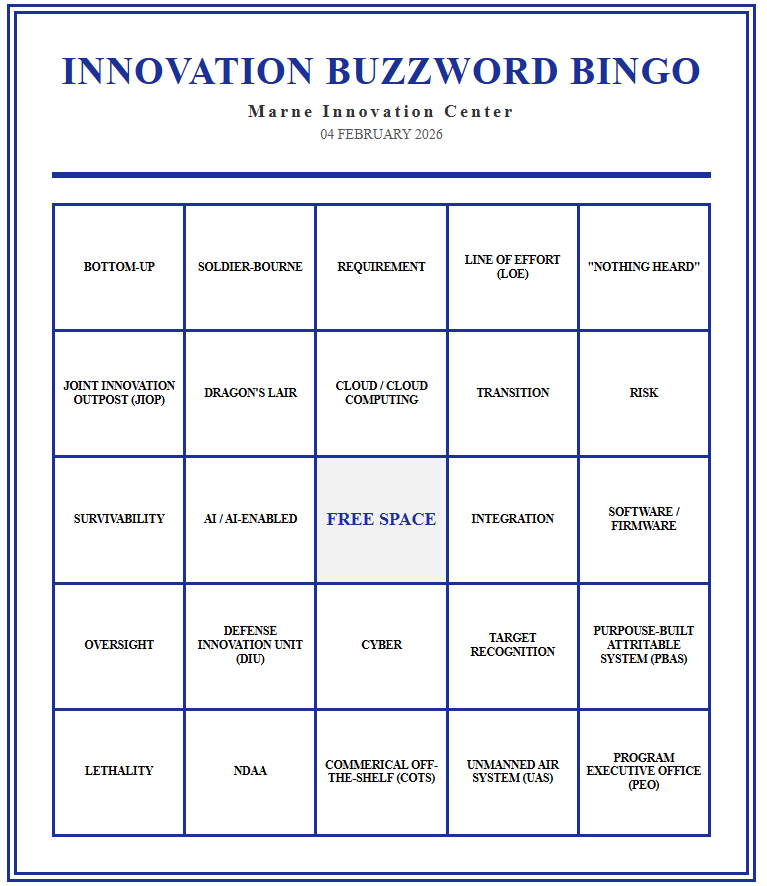

# Bingo
This program is a Bingo card generator that uses custom wordlists and outputs printable, HTML-based bingo cards.

---

## How to Use:
1. Download **Python 3**.

    **Method 1:** Download from the Microsoft Store.

    **Method 2:** Download from [Python.org](https://www.python.org/downloads/).

2. Edit or add your preferred wordslist in the ./wordlists directory of the Bingo program.

3. Edit the **GLOBAL VARIABLES** in the ./src/bingo_card_generator.py based on your preferences.

4. Open a **Powershell Prompt** in the root directory of the Bingo repository. 

5. Reference the following example commands to generate Bingo cards:
```sh
# verify python is installed
python --version

# view the arguement requirements for the Bingo Card Generator
python .\src\bingo_card_generator.py
# Expected Output --> Usage: python3 .\src\bingo_card_generator.py [bingo_terms.txt] [output.html] [count]

# create bingo cards by defining a wordslist, an output .html file, and quantity of cards
python .\src\bingo_card_generator.py .\wordlists\innovation_buzzwords.txt .\output\innovation_bingo_card.html 6
```
5. Your output HTML-based Bingo card file is now saved. View it in a web-browser and print. Due to a bug, the even pages may be blank so (in this case) print only the Odd pages. Enjoy. 

---

## Example Bingo Card:
<p align="center">
  
</p>
